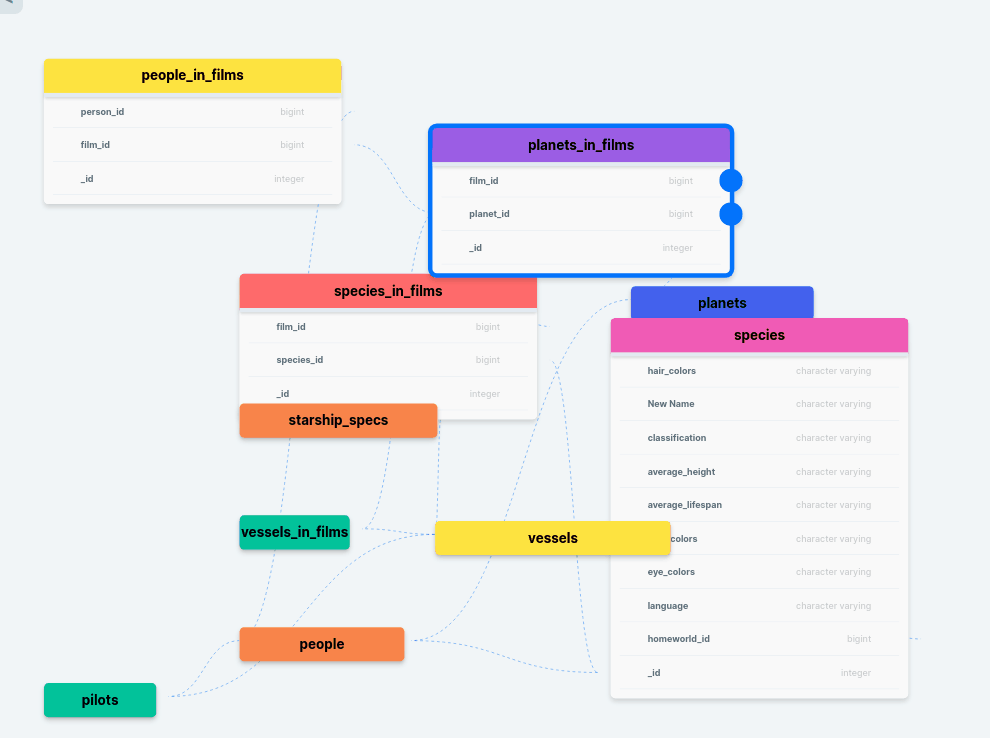
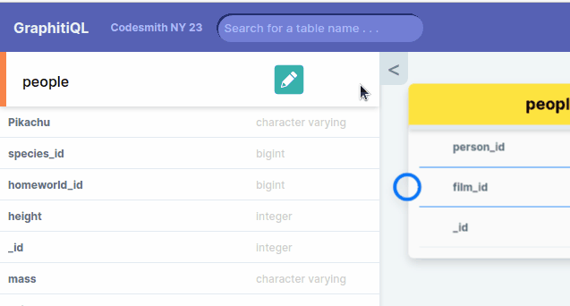
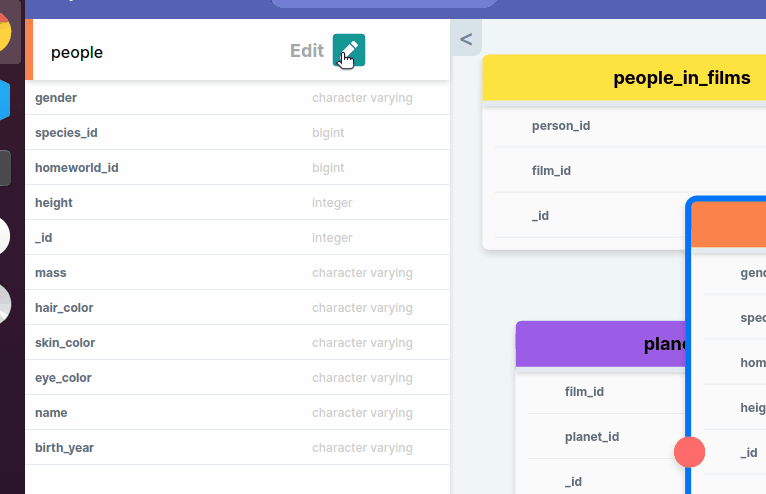

    

<h1 align="center">
<a href='https://www.giraffeql.io'>giraffeql</a>
 
</h1>
</h1>

  
  
  
   

**giraffeQL** is an open source tool that visualizes your PostgreSQL relationships to easily configure your database for a GraphQL API. In other words, you can drag-and-drop colorful tables and export Javascript!

Users can create new tables, connect columns, and edit data while seeing their changes take effect in a _real-time_ GraphQL code preview. The code can be exported ready-to-go in any application.

# <image width=30 align="center" src="./public/readme-logo.svg"> **Features**

- **Sign-in page**: Sign up for an account through GitHub OAuth, or just continue as a guest. Registered users enjoy additional project-saving functionality.

- **Start a new diagram**: Upload an existing PostgreSQL URI to auto-populate your data or start from scratch.

- **Organize your tables**: Drag-and-drop your new nodes and organize your data to best visualize the architecture of your database.

- **Search for nodes**: Search for tables by name to easily find data or relationships among large or cluttered databases.

- **Create connections**: Visualize and modify constraints between column relationships by connecting nodes with one-click.

- **Edit data**: Enter edit mode to change a table's names, fix a mistake, switch data types, or properties.

- **Add tables/columns**: Notice something missing or just want something new? Create new tables and columns easily.

- **Export your code**: Easily copy your generated code to your clipboard or export as a Javascript file to add to your project.

# <image width=30 align="center" src="./public/readme-logo.svg"> **Contributors**

[Benjamin Trosch](https://www.linkedin.com/in/benjitrosch/) [@benjitrosch](https://github.com/benjitrosch)

[Anson Avellar](https://www.linkedin.com/in/ansonavellar/) [@theansonia](https://github.com/theansonia)

[Dan Snyder](https://www.linkedin.com/in/daniel-snyder-77aa4bbb/) [@dasnyder3](https://github.com/dasnyder3)

[Eric Peng](https://www.linkedin.com/in/eric-peng-40b37b13b/) [@ericpengJoJo](https://github.com/ericpengJoJo)

___

## License

This project is licensed under the MIT License - see the [LICENSE.md](https://github.com/oslabs-beta/giraffeQL/blob/main/LICENSE) file for details.
